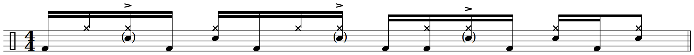
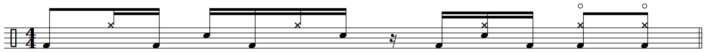
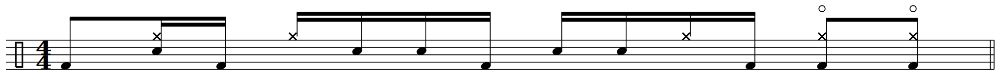
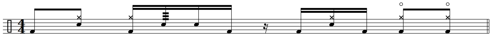
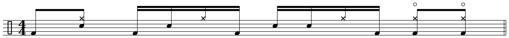

# 🥁 Ghost Note Archive

A personal archive of drum notation and practice notes, built for easy access.

## **"Cissy Strut"** | The Meters
>**Audio**:
[Spotify](https://open.spotify.com/track/0WSlOSMLJWoWUpWci9nnRb?si=64aeae497fde42e3), [YouTube](https://www.youtube.com/watch?v=oFYBRtV002s&list=RDoFYBRtV002s&start_radio=1)

**Tempo**: ♩= 88 BPM 
**Feel**: Swung 16ths

>**Section A**

>**Section B** 

