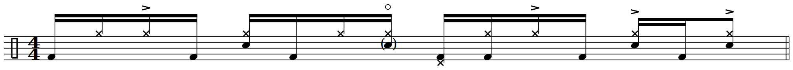
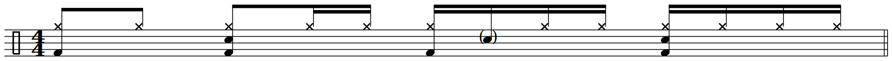
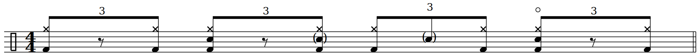

# 🥁 Ghost Note Archive

A personal archive of drum notation and practice notes, built for easy access.

## **"Cissy Strut"** | The Meters
>**Audio**:
[Spotify](https://open.spotify.com/track/0WSlOSMLJWoWUpWci9nnRb?si=64aeae497fde42e3), [YouTube](https://www.youtube.com/watch?v=oFYBRtV002s&list=RDoFYBRtV002s&start_radio=1) 
**Tempo**: ♩= 88 BPM 
**Note**: Swung 16ths.

## **"Superstition"** | Stevie Wonder
>**Audio**:
[Spotify](https://open.spotify.com/track/4N0TP4Rmj6QQezWV88ARNJ?si=42bfb2b725f34b6a), [YouTube](https://www.youtube.com/watch?v=ftdZ363R9kQ&list=RDftdZ363R9kQ&start_radio=1) 
**Tempo**: ♩= 101 BPM 
**Note**: Swung 16ths.

## **"Higher Ground"** | Stevie Wonder
>**Audio**:
[Spotify](https://open.spotify.com/track/0dMd4rilfd6gPbXaLpNYhu?si=24e1936c6d394b47), [YouTube](https://www.youtube.com/watch?v=1esf0efHbjM&list=RD1esf0efHbjM&start_radio=1) 
**Tempo**: ♩= 124 BPM 
**Note**: Semi-open hi-hat on beat four.

